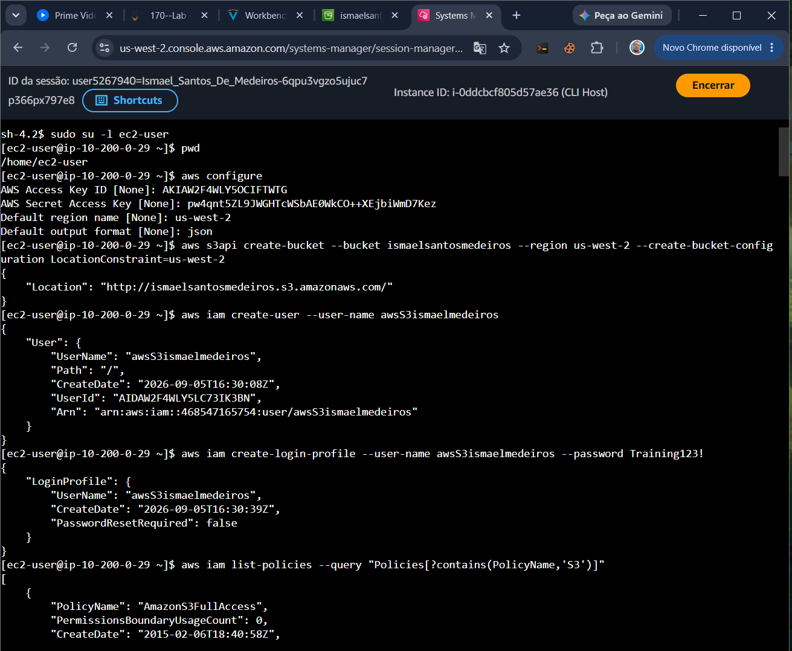
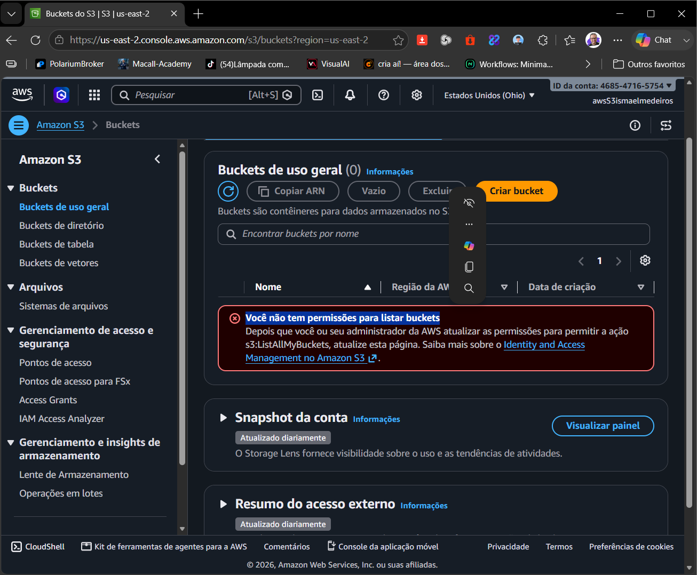
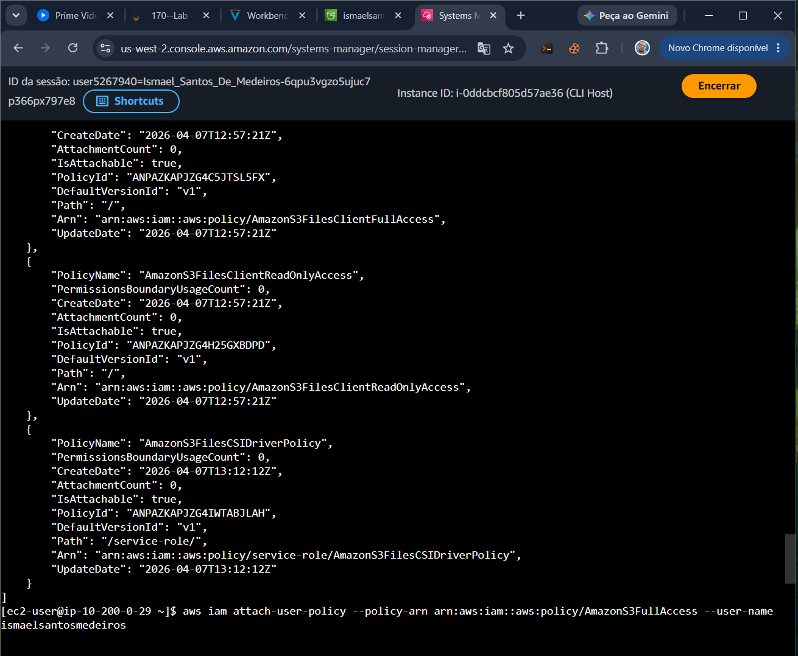
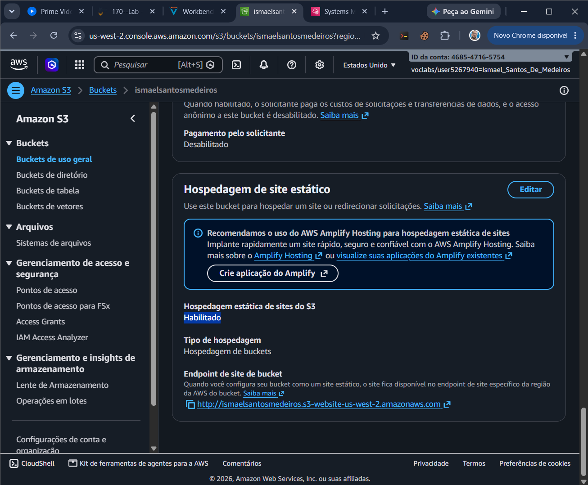
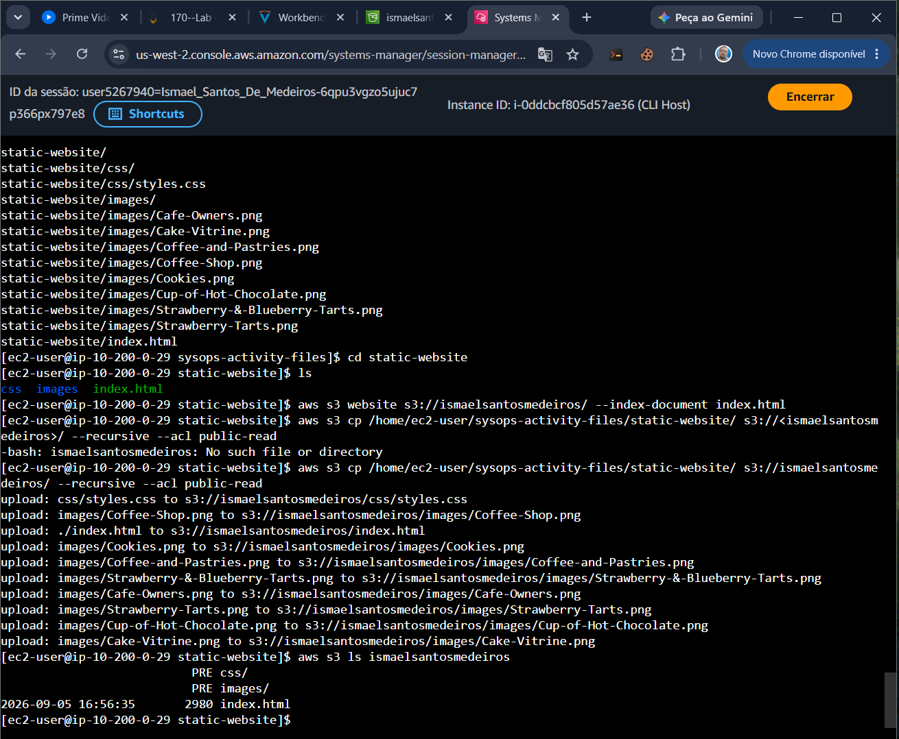
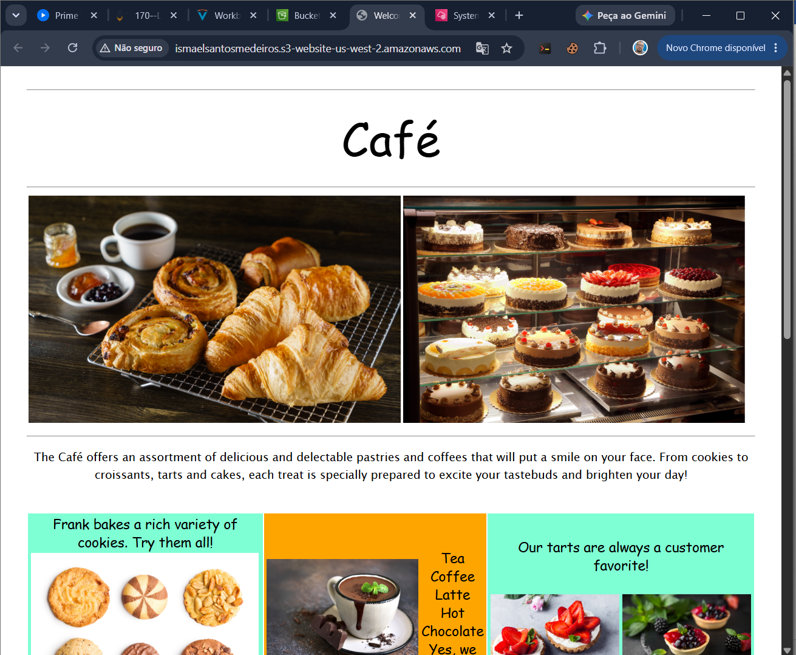

# ☁️ Creating a Website on S3 (AWS CLI, IAM & Scripting)

> ℹ️ **NOTE:** Este é o repositório desenvolvido por **Ismael Santos de Medeiros**.

Projeto com o objetivo de praticar o uso de comandos da AWS Command Line Interface (AWS CLI) a partir de uma instância Amazon EC2 para provisionar infraestrutura e hospedar um site estático no Amazon S3.

Utilizei comandos de CLI para gerenciamento do S3, configuração de acesso no IAM e scripts em Bash para automação de atualizações.

---

## 💻 Tecnologias utilizadas no projeto

- [Amazon S3](https://aws.amazon.com/s3/) — Armazenamento de objetos e hospedagem de site estático
- [AWS IAM](https://aws.amazon.com/iam/) — Gerenciamento de identidades, usuários e políticas de acesso
- [AWS CLI](https://aws.amazon.com/cli/) — Interface de linha de comando para interação com os serviços AWS
- [AWS Systems Manager (SSM)](https://aws.amazon.com/systems-manager/) — Conexão remota e segura à instância EC2
- [Linux / Bash](https://www.gnu.org/software/bash/) — Shell scripting para automação de deploy do site

---

## ✨ Como foi feito ?

- Conexão à instância Amazon Linux EC2 via SSM Session Manager
- Configuração do AWS CLI com credenciais de acesso via `aws configure`
- Criação de um bucket S3 único no us-west-2 através do comando `aws s3api create-bucket`
- Criação de novo usuário IAM (`awsS3ismaelmedeiros`) e configuração de login profile
- Resolução de problema de acesso anexando a política gerenciada `AmazonS3FullAccess` ao usuário
- Ajuste de permissões do bucket desativando o *Block Public Access* e ativando *ACLs*
- Habilitação da hospedagem de site estático via comando `aws s3 website`
- Extração dos arquivos do site e upload para o bucket S3 com acesso de leitura pública via `aws s3 cp`
- Criação e permissão de execução de um script em lote em Shell Script (`update-website.sh`) para automatizar atualizações
- Otimização do script substituindo o comando `aws s3 cp` por `aws s3 sync` para transferir apenas arquivos modificados

---

## 📚 Materiais

- Script de atualização em lote localizado no arquivo `update-website.sh`
- Código-fonte do site localizado na pasta `sysops-activity-files/static-website/`
- Documentação AWS CLI para o comando sync: [AWS CLI Sync Reference](https://awscli.amazonaws.com/v2/documentation/api/latest/reference/s3/sync.html)

---

## 🛠️ Instruções de execução

Para replicar o resultado e implantar o site estático via AWS CLI, siga o passo a passo abaixo.

- 🤖 1. Conecte-se à instância Linux e altere o usuário para `ec2-user` executando `sudo su -l ec2-user`
- 🤖 2. Configure suas credenciais na CLI com `aws configure` definindo a região `us-west-2` e formato `json`
- 🤖 3. Crie o bucket S3 rodando `aws s3api create-bucket --bucket ismaelsantosmedeiros --region us-west-2 --create-bucket-configuration LocationConstraint=us-west-2`
- 🤖 4. Crie o usuário no IAM com `aws iam create-user --user-name awsS3ismaelmedeiros` e defina a senha com `aws iam create-login-profile --user-name awsS3ismaelmedeiros --password Training123!`

- 🤖 5. Ao tentar listar buckets no console com o novo usuário, um erro de falta de permissão será exibido:

- 🤖 6. Conceda acesso total ao S3 para o usuário anexando a política: `aws iam attach-user-policy --policy-arn arn:aws:iam::aws:policy/AmazonS3FullAccess --user-name awsS3ismaelmedeiros`

- 🤖 7. No console do S3, desmarque a opção "Block all public access" e ative as "ACLs" nas permissões do bucket
- 🤖 8. Ative a hospedagem estática executando `aws s3 website s3://ismaelsantosmedeiros/ --index-document index.html`

- 🤖 9. Extraia os arquivos e envie para o S3 com o comando `aws s3 cp /home/ec2-user/sysops-activity-files/static-website/ s3://ismaelsantosmedeiros/ --recursive --acl public-read`

- 🤖 10. Crie o script de automação com `vi update-website.sh` contendo o comando `aws s3 sync /home/ec2-user/sysops-activity-files/static-website/ s3://ismaelsantosmedeiros/ --acl public-read`
- 🤖 11. Dê permissão de execução com `chmod +x update-website.sh` e execute com `./update-website.sh` para atualizar o site

> **📹 Demonstração em Vídeo:** Assista ao passo a passo completo da execução do laboratório acelerado no YouTube:

- 🤖 12. Acesse a URL pública do site estático para confirmar o funcionamento:

---

## 👨‍💻 Expert

    
    
&nbsp&nbsp&nbspIsmael Medeiros 
    &nbsp&nbsp&nbsp
    <a 
        href="https://github.com/ism-dev-codes">
        GitHub
    </a>
    &nbsp;|&nbsp;
    <a 
        href="https://www.linkedin.com/in/ismael-medeiros">
        LinkedIn
    </a>
    &nbsp;|&nbsp;
    <a 
        href="https://www.instagram.com/ismaelsmedeiros?igsh=YXA1OW1mNXhkNmVy">
        Instagram
    </a>
    &nbsp;|&nbsp;

  

